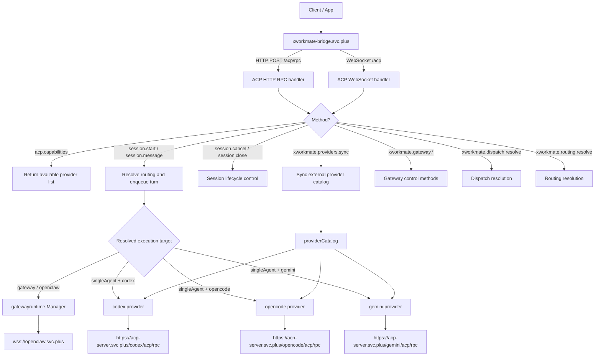

# ACP Forwarding Topology

This document describes how `xworkmate-bridge.svc.plus` forwards requests to the public ACP and gateway endpoints.

## Topology

## Request Flow

The bridge accepts ACP JSON-RPC over `POST /acp/rpc` and ACP WebSocket traffic over `/acp`.

For `session.start` and `session.message`, the server resolves routing metadata, selects either the gateway runtime or a single-agent provider, and then forwards the turn to the resolved endpoint.

For the public single-agent ACP providers, `http` and `https` endpoints are forwarded as JSON-RPC `POST .../acp/rpc` requests, while `ws` and `wss` endpoints are forwarded as WebSocket ACP sessions on `/acp`.

## Current Public Endpoints

- `wss://openclaw.svc.plus`
- `https://acp-server.svc.plus/codex/acp/rpc`
- `https://acp-server.svc.plus/opencode/acp/rpc`
- `https://acp-server.svc.plus/gemini/acp/rpc`
