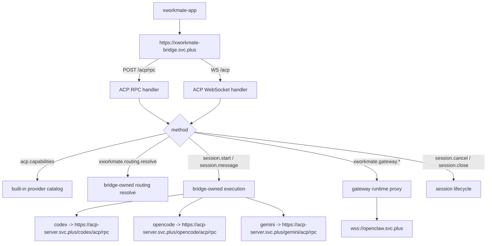
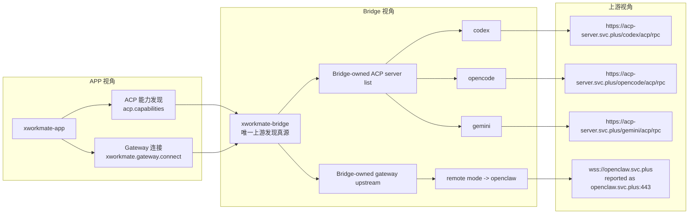

# ACP Forwarding Topology

This document describes the bridge-only production forwarding model for `xworkmate-bridge.svc.plus`.

## Topology

## Three-Layer View

This view separates what the app sees, what the bridge owns, and what the
real upstream production targets are.

Important distinction:

- `acp.capabilities.providerCatalog` currently advertises only the ACP
  single-agent providers: `codex`, `opencode`, and `gemini`
- `gateway` is not part of that provider catalog; it is exposed through the
  separate `xworkmate.gateway.*` bridge-owned runtime path
- for remote gateway mode, the bridge rewrites the upstream target to
  `wss://openclaw.svc.plus`

## Production Truth

Bridge owns the production map:

- `codex` -> `https://acp-server.svc.plus/codex/acp/rpc`
- `opencode` -> `https://acp-server.svc.plus/opencode/acp/rpc`
- `gemini` -> `https://acp-server.svc.plus/gemini/acp/rpc`
- gateway -> `wss://openclaw.svc.plus`

Upstream auth is bridge-internal:

- `Authorization: Bearer $INTERNAL_SERVICE_TOKEN`

## Invariants

- app-facing cloud entry is only `https://xworkmate-bridge.svc.plus`
- `acp.capabilities` returns the built-in production catalog
- no production `xworkmate.providers.sync`
- no app direct call to `acp-server.svc.plus/*`
- no app direct call to `openclaw.svc.plus`
- remote gateway runtime status is reported as `openclaw.svc.plus:443`, but the app still talks only to the bridge
